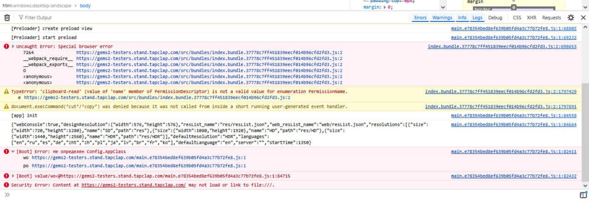
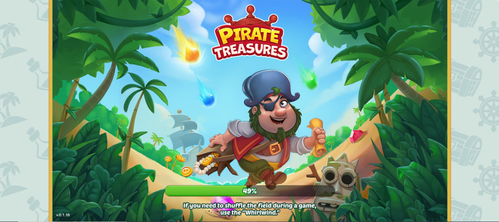
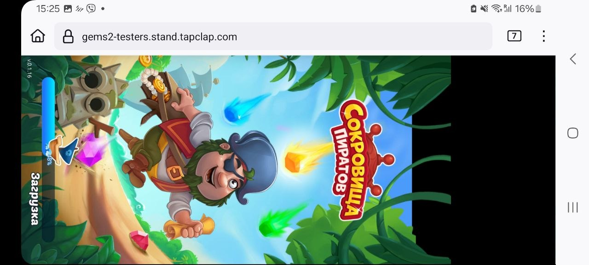

## 1. Тестирование тестовой версии игры

> Пройдите по ссылке в тестовую версию игры: Тестовая версия игры В тестовой версии игры скрыты баги. Найдите и опишите их так, как если бы вы ставили задачу на разработчика. Тестировать нужно как с компьютера, так и с мобильного устройства.

**Репозиторий с результатами тестирования**: [Dubinetsky/tapclap](https://github.com/Dubinetsky/tapclap).

\newpage

### Журнал тестирования

1. Запустила тестовую версию в Firefox. Игра не прошла загрузку до игрового состояния; ошибку воспроизвела повторно и зафиксировала отдельно.
2. Перешла в Chrome и вручную прошла игровой сценарий. Ближе к завершению уровня поле перестало принимать действия; состояние удалось воспроизвести повторно.
3. Стало понятно, что для проверки такого дефекта одних ручных повторов недостаточно: необходимо фиксировать состояние поля перед каждым ходом и уметь воспроизводить последовательность действий.
4. Начала с простого input probe: определила геометрию сетки и проверила, что программно отправленные действия действительно доходят до игрового canvas.
5. После первых экспериментов решила не наращивать набор одноразовых сниппетов, а сделать небольшой переиспользуемый test harness и документировать способ проверки.
6. Определила движок как Cocos2d-JS. Для дальнейшей работы выбрала public API движка как основной интерфейс; внутреннее состояние игры оставила только как возможный fallback.
7. Через scene graph нашла игровую сетку 7×7 и слой игровых элементов. По SpriteFrame удалось стабильно различать шесть типов фишек без обращения к приватной игровой логике.
8. На основе считанного состояния реализовала независимый поиск допустимых match-3 ходов и сверила результат со штатной подсказкой игры. В контрольной позиции оба способа указали один и тот же ход.
9. Добавила преобразование координат Cocos в browser coordinates и выполнение реального drag через gameCanvas. Полный цикл `read → find move → input → read new state` подтвердился.
10. После этого прототип был выделен в отдельную систему WARDEN: ядро для чтения состояния, выполнения повторяемых проверок и сценарных тестов.

\newpage

_Тестовое задание TAPCLAP на позицию Manual QA / тестовая веб-сборка Pirate Treasures._

### BUG-01. Pirate Treasures does not complete startup in Firefox

**issues:** [Pirate Treasures does not complete startup in Firefox](https://github.com/Dubinetsky/tapclap/issues/1)

Наблюдалось Оксаной Дубинецкой во время ручного тестирования на компьютере, впоследствии также воспроизведено на Android-смартфоне.

**Окружение 1:**

- Desktop Firefox
- Тестовая сборка: Pirate Treasures
- Браузер для сравнения: Chrome

**Окружение 2:**

- Firefox Mobile на Android
- Тестовая сборка: Pirate Treasures
- Браузер для сравнения: Chrome Mobile

**Наблюдаемое поведение:**

В Firefox страница доходит до прелоадера, но игра не завершает запуск и не переходит к игровому процессу. Поведение воспроизводится как на desktop, так и на Android.

Во время desktop-проверки в Firefox первой явно фатальной ошибкой в консоли была:
Uncaught Error: Special browser error

Позже появляется следующая ошибка загрузки:
[Boot] Error: Не определен Config.AppClass

**Ожидаемое поведение:**

Игра должна успешно завершить запуск и перейти к игровому процессу в поддерживаемом браузере как на desktop, так и на мобильном устройстве.

**Сравнение:**

На том же тестовом стенде игра успешно переходит к игровому процессу в Chrome на desktop и в Chrome Mobile на Android.

**Текущая интерпретация:**

Ошибка Config.AppClass рассматривается как вероятное следствие более ранней ошибки bundle, поскольку она возникает позже. Точная первопричина на данный момент не утверждается.

**Статус:**

Обнаружено вручную. Подтверждено на двух типах устройств: desktop и Android-смартфоне.

**Источник наблюдения:**

[Manual] [DevTools]

**Доказательства:**

Скриншоты воспроизведения на desktop и Android, а также лог консоли desktop Firefox.

{#fig:firefox-startup-1 width="100%"}

{#fig:firefox-startup-2 width="100%"}

{#fig:firefox-startup-3 width="100%"}

\clearpage

### BUG-02. Game freezes during level transition: board remains visible and input becomes unresponsive

**issues:** [Game freezes during level transition: board remains visible and input becomes unresponsive](https://github.com/Dubinetsky/tapclap/issues/2)

Наблюдалось Оксаной Дубинецкой во время ручного тестирования на компьютере, впоследствии повторно воспроизведено во время автоматизированного прогона с помощью [https://github.com/pan-canon/TheWorldOfCanon/tree/main/work/tapclap/warden](WARDEN).

**Окружение:**

- Desktop Google Chrome
- Тестовая сборка: Pirate Treasures
- Engine: Cocos2d-JS v3.17
- Environment: test
- Игровое поле: 7×7

**Наблюдаемое поведение:**

При прохождении уровня ближе к его завершению игровое поле перестаёт реагировать на действия пользователя.

Визуально поле остаётся на экране, однако дальнейшие перестановки фишек не выполняются, а ожидаемый переход к следующему состоянию игры не завершается.

Проблема первоначально была воспроизведена вручную, а затем повторно во время автоматизированного прогона с помощью WARDEN.

До возникновения зависания WARDEN корректно определял поле как полную и читаемую сетку 7×7 с шестью типами фишек.

**Шаги воспроизведения:**

1. Открыть тестовую версию игры в Chrome.
2. Начать уровень и выполнять допустимые ходы.
3. Продолжать игру до состояния, близкого к завершению уровня.
4. Наблюдать состояние игры после очередного хода.
5. Попытаться выполнить следующий ход на поле.

\newpage

Для повторного автоматизированного воспроизведения использовался WARDEN:

```js
window.warden = await WARDEN.init({
  rows: 7,
  cols: 7,
  cellSize: 72,
  expectedTypes: 6
});
```

Контрольный короткий прогон:

```js
await warden.run({ maxSteps: 10 });
```

Длинный прогон:

```js
await warden.run({ maxSteps: 50 });
```

**Ожидаемое поведение:**

После выполнения условий уровня игра должна корректно завершить текущее игровое состояние и перейти к следующему экрану или состоянию.

Поле не должно оставаться визуально активным в состоянии, когда пользовательский ввод больше не обрабатывается.

**Сравнение:**

Короткий контрольный прогон из 10 последовательных допустимых ходов проходит полностью: каждый ход завершается изменением состояния поля.

```text
[WARDEN] RUN START {maxSteps: 10}
[WARDEN] PASS BOARD_CHANGED
[WARDEN] PASS BOARD_CHANGED
...
[WARDEN] RUN FINISHED
```

Все 10 ходов контрольного прогона завершились успешно.

\newpage

Во время более длинного прогона также выполняется продолжительная последовательность допустимых ходов:

```text
[WARDEN] RUN START {maxSteps: 50}
[WARDEN] perform {...}
[WARDEN] PASS BOARD_CHANGED
[WARDEN] perform {...}
[WARDEN] PASS BOARD_CHANGED
...
```

После очередного хода WARDEN перестаёт получать стабильное читаемое состояние поля и завершает ожидание по таймауту:

```text
[WARDEN] RUN STOP {
  status: 'ERROR',
  error: 'Error: WARDEN: board did not reach a stable readable state'
}
```

После возникновения зависания повторное чтение обычного игрового поля также становится невозможным:

```text
Uncaught Error: WARDEN: gem layer not found for 7x7
    at discoverGemLayer
    at Object.read
```

При этом сама Cocos-сцена продолжает существовать: в scene graph остаются видимые и активные (`visible: true`, `running: true`) игровые узлы. Визуально поле также остаётся на экране.

**Текущая интерпретация:**

После перезагрузки страницы игра загружается уже в последующем состоянии прогресса: появляются дальнейшие задания и контент.

Это позволяет предположить, что проблема возникает во время клиентского перехода между состояниями уровня: прогресс уже может быть обработан, тогда как визуальное состояние не завершает переход корректно.

До зависания слой игрового поля определялся в scene graph как:

```text
scene/Class[0]/gameViewLayer[6]/Class[0]/Class[3]
```

и содержал читаемую сетку 7×7.

После зависания структура scene graph изменяется, и WARDEN больше не может определить стандартный слой игрового поля, хотя остальные узлы сцены продолжают работать.

Это согласуется с гипотезой о незавершённом переходе игрового состояния, но не доказывает конкретную внутреннюю причину дефекта.

**Статус:**

Обнаружено вручную. Повторно воспроизведено автоматизированным прогоном WARDEN.

**Источник наблюдения:**

`[Manual] [WARDEN] [DevTools]`

**Доказательства:**

- Ручное воспроизведение зависания;
- Повторное воспроизведение во время длинного WARDEN-прогона;
- Успешный контрольный прогон из 10 последовательных ходов;
- Лог остановки по `board did not reach a stable readable state`;
- Последующая ошибка `gem layer not found for 7x7`;
- Наблюдение scene graph до и после зависания;
- Скриншот игрового поля в зависшем состоянии;
- runtime-лог Cocos2d-JS v3.17.

Конфигурация runtime подтверждает тестовое окружение: `production: false`, `market: "test"`.

\newpage

## 2. Приведите примеры тестирования методом граничных значений в нашей игре

Метод граничных значений — это проверка значений непосредственно на границе допустимого диапазона и рядом с ней: обычно N−1, N, N+1. Именно в таких переходных состояниях часто проявляются ошибки.

Примеры для игры:

1. **Оставшиеся ходы на уровне:** проверить состояния с 2, 1 и 0 ходами. Особенно важен последний ход: сначала должны полностью обработаться созданная комбинация и возможные каскады, и только затем игра должна определить победу или поражение.
2. **Счётчик цели уровня:** если осталось собрать 2, 1 и 0 объектов, проверить корректность уменьшения счётчика. При достижении 0 уровень должен завершиться один раз, а значение не должно уходить в отрицательное.
3. **Количество доступных ходов на поле:** проверить состояния с 0, 1 и несколькими допустимыми ходами. При одном допустимом ходе подсказка должна указывать на него; при отсутствии ходов игра должна корректно обработать это состояние, например выполнить перемешивание, если такая механика предусмотрена.
4. **Границы игрового поля:** проверить перестановки на первой и последней строке, первом и последнем столбце и в углах. Попытка свайпа за пределы поля не должна приводить к некорректному обмену, ошибке или зависанию.
5. **Порог открытия механики или контента:** если функция становится доступна с уровня N, проверить N−1, N и N+1: до порога она должна быть недоступна, на самом пороге открыться, а после него оставаться доступной.

Отдельно важен переход из состояния «цель ещё не выполнена» в состояние «цель выполнена», особенно если это происходит последним ходом. В этот момент одновременно меняются состояние поля, результат уровня и интерфейс следующего экрана.

Во время тестирования как раз был обнаружен дефект на такой границе: после завершения игрового состояния поле оставалось отображённым, но переставало принимать ввод и ожидаемый переход дальше не завершался. Сам по себе этот дефект относится к функциональному тестированию, но момент его возникновения является хорошим примером того, почему граничные переходы нужно проверять отдельно.

\newpage

## 3. После крупного обновления упала производительность Android-версии игры

> Ваш руководитель и коллеги по отделу QA в отпуске. После крупного обновления в четверг массово поступают жалобы от пользователей, что упала производительность android-версии игры. Вы узнаете об этому в пятницу утром. Времени мало, откатить версию нет возможности, программисты ждут информации и локализации проблемы. Составьте, пожалуйста, чек-лист ваших действий в приоритетном порядке.

В такой ситуации моя первая задача — как можно быстрее не просто подтвердить проблему, а сузить её до конкретного сценария, устройства или изменения, чтобы разработчики могли начать работу.

1. Просмотреть обращения пользователей и сгруппировать симптомы: падение FPS, долгие загрузки, фризы, зависания, нагрев, повышенный расход батареи и т. д. Отдельно отметить модели устройств, версии Android и игровые сценарии, которые повторяются чаще всего.
2. Уточнить, действительно ли проблема появилась после последнего обновления, и посмотреть, какие подсистемы или ресурсы менялись в этом релизе.
3. Попробовать быстро воспроизвести проблему на нескольких Android-устройствах: сначала на конфигурациях, которые чаще всего встречаются в жалобах, затем на контрольном устройстве.
4. Сузить сценарий воспроизведения: определить, возникает ли деградация при запуске, на карте, во время уровня, при каскадах и эффектах, после рекламы, при переходах между экранами или после длительной сессии.
5. Зафиксировать измеримые показатели: FPS/frame time, время загрузки, использование CPU, RAM и GPU, возможный рост памяти, нагрев и сетевую активность. Если доступны, использовать Android Vitals, Firebase Performance/Crashlytics, Android Profiler, Perfetto или adb.
6. Проверить зависимости: модель устройства и GPU, версия Android, разрешение экрана, графические настройки, сеть, продолжительность сессии, конкретный уровень или новая механика.
7. Если доступна предыдущая сборка, сравнить тот же сценарий на ней. Production откатывать нельзя, но старая APK может быть полезна как контроль для локализации регрессии.
8. Как только появляется устойчивое воспроизведение, сразу передать разработчикам минимальный пакет: build, устройство, Android version, шаги, expected/actual result, частоту воспроизведения, видео, логи и метрики. Не ждать окончания полного исследования, если информации уже достаточно для начала исправления.
9. Параллельно проверять гипотезы разработчиков и уточнять область проблемы.
10. После исправления проверить fix именно на проблемных конфигурациях и выполнить короткий performance regression smoke по основным игровым сценариям.

\newpage

## 4. Чек-лист проверки бонусного мира «Знакомство с пиратом»

> В тестовой версии игры есть бонусный мир “Знакомство с пиратом”.
> Основываясь на своем опыте из первого задания, напишите чек-лист для проверки этого бонусного мира.

Во время проверки я прошла первые три уровня бонусного мира и использовала фактически встреченные состояния как основу чек-листа.

1. Проверить вход в бонусный мир с основной карты по кораблю.
2. Проверить корректность первого tutorial-состояния: затемнение фона, реплика персонажа, указатель на нужный элемент, блокировка лишних действий.
3. Проверить открытие карточки уровня: номер уровня, цель, доступные/заблокированные элементы, кнопки Play и X.
4. Проверить запуск уровня после нажатия Play.
5. Проверить отображение цели уровня и исходного количества ходов.
6. Проверить tutorial внутри уровня: подсказка должна показывать допустимое действие и не приводить игру в некорректное состояние при попытке нажать или свайпнуть в другом месте.
7. Проверить базовые match-3 действия: допустимый swap, недопустимый swap, каскады и заполнение освободившихся клеток.
8. Проверить специальные комбинации, которым обучает бонусный мир, и соответствие результата показанной подсказке.
9. Проверить изменение счётчика цели после уничтожения необходимых объектов.
10. Проверить уменьшение числа ходов и граничные состояния 2, 1, 0.
11. Проверить завершение уровня при выполнении цели.
12. Проверить экран Level completed: количество звёзд, очки, кнопки Next, Share, X.
13. Проверить переход на следующий уровень через Next.
14. Проверить последовательное открытие уровней и отсутствие возможности начать ещё заблокированный уровень раньше времени.
15. Проверить накопительный прогресс бонусного мира/сундука после прохождения уровней.
16. Проверить повторный вход в бонусный мир после выхода на основную карту.
17. Проверить сохранение прогресса после перезагрузки страницы или перезапуска игры.
18. Проверить поражение при окончании ходов без выполнения цели и возможность повторного запуска уровня.
19. Проверить закрытие карточки уровня и экрана завершения через X, а также возврат в ожидаемое предыдущее состояние.
20. Проверить несколько быстрых последовательных нажатий на Play, Next, X, чтобы исключить двойной запуск уровня или наложение экранов.
21. Проверить, что после нескольких пройденных уровней счётчики, награды и состояние карты не сбрасываются и не дублируются.
22. Повторить основные проверки на мобильном устройстве: масштабирование UI, tap/swipe, читаемость tutorial, ориентация экрана и отсутствие перекрывающихся элементов.

Отдельное внимание я бы уделила переходам между состояниями: запуск уровня, завершение цели, экран результата, Next и возврат на карту. В основном игровом сценарии уже был найден дефект именно на переходе после завершения уровня, поэтому аналогичные точки в бонусном мире считаю повышенно рискованными.

\newpage

## 5. Напишите тест-кейс(ы) (не более 10) на проверку уровня и/или любой игровой механики из нашей игры.

Для повторяемых проверок я вынесла восемь сценариев в WARDEN. Они используют одно и то же ядро чтения состояния поля и ввода, поэтому в самих кейсах не дублируется обход scene graph или логика взаимодействия с canvas.

### TC-01. Допустимая перестановка

**Что проверяет:** WARDEN находит допустимый match-3 ход, отправляет его в игру и проверяет, что после завершения анимации логическое состояние поля изменилось.

**Ожидаемый результат:** существует хотя бы один legal move; после его выполнения поле отличается от исходного.

**Автоматизированный сценарий**: [https://github.com/Dubinetsky/tapclap/blob/main/scenarios/TC-01-valid-swap-snippet.js](../scenarios/TC-01-valid-swap-snippet.js).

### TC-02. Недопустимая перестановка

**Что проверяет:** WARDEN выбирает соседнюю пару, которая по независимому solver не создаёт match-3, и выполняет обмен.

**Ожидаемый результат:** после возможной reject-анимации итоговое состояние поля совпадает с исходным; недопустимый swap не должен менять доску.

**Автоматизированный сценарий:** [https://github.com/Dubinetsky/tapclap/blob/main/scenarios/TC-02-invalid-swap-snippet.js](../scenarios/TC-02-invalid-swap-snippet.js).

### TC-03. Каскад и заполнение поля

**Что проверяет:** выполняется один допустимый ход, после чего WARDEN ждёт окончания каскадов и refill.

**Ожидаемый результат:** после завершения всех анимаций поле снова читается как полная и стабильная сетка. Сценарий не считает количество каскадов, а проверяет возвращение игры в корректное читаемое состояние.

**Автоматизированный сценарий**: [https://github.com/Dubinetsky/tapclap/blob/main/scenarios/TC-03-cascade-refill-snippet.js](../scenarios/TC-03-cascade-refill-snippet.js).

### TC-04. Проверка штатной подсказки

**Что проверяет**: без взаимодействия с полем WARDEN ждёт штатную hint-анимацию и пытается определить подсказанную пару клеток по публичным свойствам Nodes. Затем эта пара сравнивается с независимо рассчитанным списком legal moves.

**Ожидаемый результат:**

* `VALID_HINT` — подсказка соответствует допустимому ходу;
* `INVALID_HINT` — подсказка не входит в список допустимых ходов и является кандидатом на дефект;
* `AMBIGUOUS` — наблюдатель не смог уверенно распознать анимацию, но такой результат не считается провалом игры.

**Автоматизированный сценарий:** [https://github.com/Dubinetsky/tapclap/blob/main/scenarios/TC-04-hint-validation-snippet.js](../scenarios/TC-04-hint-validation-snippet.js).

### TC-05. Несколько последовательных допустимых ходов

**Что проверяет:** WARDEN выполняет десять последовательных допустимых ходов. После каждого хода реальное состояние поля считывается заново, а legal moves пересчитываются уже для новой позиции.

**Ожидаемый результат**: все десять шагов завершаются со статусом `MOVED`; очередь ходов не строится заранее, потому что каскад и refill изменяют состояние поля.

**Автоматизированный сценарий:** [https://github.com/Dubinetsky/tapclap/blob/main/scenarios/TC-05-repeated-play-snippet.js](../scenarios/TC-05-repeated-play-snippet.js).

### TC-06. Стабильность чтения поля

**Что проверяет:** после `waitStable()` WARDEN дважды считывает игровую матрицу с небольшой паузой.

**Ожидаемый результат:** оба чтения полные, а логическая матрица между ними не меняется. Этот кейс проверяет пригодность board reader как основы для остальных автоматизированных сценариев.

**Автоматизированный сценарий:** [https://github.com/Dubinetsky/tapclap/blob/main/scenarios/TC-06-board-stability-snippet.js](../scenarios/TC-06-board-stability-snippet.js).

### TC-07. Блокировка ввода

**Что проверяет:** WARDEN последовательно выполняет допустимые ходы и ищет состояние, при котором независимый solver видит legal move, корректный drag отправлен в игру, но итоговое состояние поля не изменилось.

**Ожидаемый результат:** если блокировка не воспроизводится, сценарий завершается как `NOT REPRODUCED`. Если состояние найдено, WARDEN сохраняет диагностический snapshot, конкретный ход и состояние доски. Сам сценарий не объявляет root cause.

**Автоматизированный сценарий:** [https://github.com/Dubinetsky/tapclap/blob/main/scenarios/TC-07-input-lock-snippet.js](../scenarios/TC-07-input-lock-snippet.js).

### TC-08. Переход после завершения уровня

**Что проверяет:** WARDEN продолжает выполнять допустимые ходы до одного из условий остановки: игровая сетка исчезла или сменилась сцена, закончились legal moves, обнаружена блокировка ввода либо достигнут защитный лимит ходов.

**Ожидаемый результат:** исчезновение обычной сетки трактуется только как кандидат на переход уровня. Финальное окно или экран завершения уровня после этого проверяется вручную. Если поле не реагирует на legal move, сценарий сохраняет соответствующее диагностическое состояние.

**Автоматизированный сценарий:** [https://github.com/Dubinetsky/tapclap/blob/main/scenarios/TC-08-level-completion-snippet.js](../scenarios/TC-08-level-completion-snippet.js).

\newpage

## 6. Игроки стали часто проигрывать на 10-м уровне, но среднее число использованных ходов почти не изменилось. Предложите не менее трёх возможных причин и способы их проверки

Сам факт, что среднее число использованных ходов почти не изменилось, означает, что сначала я бы не делала вывод о нехватке ходов. Игроки по-прежнему тратят примерно столько же действий, но результат этих действий мог стать хуже. Также среднее значение может скрывать изменения внутри отдельных групп игроков.

1. **Уровень стал объективно сложнее при том же количестве ходов?**

   Например, могла измениться цель уровня, количество препятствий, расположение элементов или вероятность появления нужных фишек.

   **Как проверить:** сравнить текущую конфигурацию 10-го уровня с предыдущей версией + несколько раз пройти уровень на обеих сборках + сравнить win rate, число выполненных целей к последнему ходу и распределение оставшихся невыполненных целей.

2. **Изменилась генерация или перемешивание игрового поля?**

   Количество ходов остаётся тем же, но игроку чаще попадаются менее выгодные стартовые позиции, меньше доступных комбинаций или хуже формируются специальные элементы.

   **Как проверить:** собрать выборку стартовых полей и игровых сессий до и после изменения + сравнить количество доступных ходов, частоту reshuffle, количество каскадов и создаваемых специальных комбинаций. Дополнительно можно автоматически прогнать большое число состояний независимым solver.

3. **Какая-либо механика перестала работать или стала работать иначе?**

   Например, комбинация уничтожает меньше объектов, цель не всегда засчитывается, специальная фишка действует неправильно или часть результата каскада теряется.

   **Как проверить:** воспроизвести основные механики 10-го уровня отдельно и проверить изменение счётчиков после каждого действия. Сопоставить визуальный результат на поле с фактическим прогрессом цели.

4. **Изменился состав игроков, дошедших до 10-го уровня?**

   После обновления или изменения ранних уровней до него могла начать доходить другая аудитория: например, больше новых игроков, которые хуже знают механику.

   **Как проверить:** сегментировать статистику по новым и возвращающимся игрокам, версии клиента, дате установки, платформе и другим доступным признакам. Сравнить win rate внутри одинаковых когорт, а не только общий показатель.

5. **Среднее количество ходов скрывает изменение распределения?**

   Например, раньше часть игроков выигрывала за 15 ходов, а часть проигрывала за 25, а теперь почти все доходят до последних ходов и чаще проигрывают. Среднее при этом может измениться совсем немного.

   **Как проверить:** посмотреть не только среднее, но и медиану, распределение использованных ходов, а также отдельно среднее для побед и поражений. Дополнительно сравнить, на каком ходу чаще всего завершается успешная и неуспешная попытка.

В первую очередь я бы проверила изменения самого уровня и игровых механик, потому что рост проигрышей при примерно неизменном количестве ходов больше похож на снижение эффективности каждого хода, чем просто на изменение лимита ходов.

\newpage

## 7. Опишите, как бы вы обучили игрока новой механике, не используя длинные текстовые инструкции

Я бы обучала через сам геймплей по принципу:

показать >> дать попробовать >> проверить понимание >> усложнить

Сначала я бы поставила игрока в безопасную ситуацию, где новая механика очевидно полезна и почти невозможно ошибиться. Нужный объект или действие подсвечиваются визуально, а интерфейс даёт короткую контекстную подсказку — например, иконку кнопки вместо длинного текста. После первого действия игрок сразу получает понятный feedback: анимацию, звук или изменение состояния мира.

Дальше я бы дала похожую ситуацию уже без явной подсказки, чтобы игрок самостоятельно повторил действие. После этого механику можно постепенно сочетать с уже знакомыми системами и повышать сложность. Таким образом обучение происходит через контролируемую последовательность игровых ситуаций, а не через длинное объяснение правил.

\newpage

## 8. Семидневный ивент из 30 этапов: длительность и распределение наград

| Ивент длится семь дней и состоит из 30 этапов. Определите, сколько времени активному игроку потребуется для его завершения, и предложите распределение наград.

Без данных о средней длительности этапа и проценте повторных попыток точное время определить нельзя, поэтому сначала задам рабочее допущение.

Если один этап занимает в среднем 5–6 минут, а часть сложных этапов требует повторного прохождения, то 30 этапов займут примерно 3–4 часа чистого игрового времени.

Для семидневного ивента я бы ориентировалась на такой темп:

* Примерно 4–5 этапов в день;
* Около 25–35 минут активной игры в день;
* Активный игрок сможет закончить ивент примерно за 5–6 дней, оставив последний день как запас на пропущенную сессию или сложные этапы.

Мне кажется важным, чтобы обязательный ежедневный объём не требовал от игрока проходить событие по часу в день: ивент должен мотивировать регулярно возвращаться, но не превращаться в отдельную работу.

Распределение наград:

1. Каждый этап — небольшая гарантированная награда, чтобы прохождение всегда давало видимый прогресс.
2. Каждый 5-й этап — более заметная milestone-награда: этапы 5, 10, 15, 20 и 25.
3. Этап 30 — главная награда события: наиболее редкий или ценный приз.
4. Общую ценность наград я бы постепенно увеличивала к концу события: первые этапы дают быстрый положительный feedback, а последние создают мотивацию завершить весь ивент.
5. Примерно 50–60% общей ценности наград можно распределить по обычным этапам и промежуточным milestone, а оставшиеся 40–50% оставить на последние milestone и финальную награду.
6. Я бы не концентрировала почти всю ценность только на 30-м этапе: игрок, который активно участвовал, но не успел пройти последние несколько этапов, всё равно должен получить ощутимую награду за потраченное время.

Дополнительно я бы проверила баланс по реальным данным после запуска: среднее время этапа, число попыток, процент игроков, дошедших до этапов 5/10/15/20/25/30, и точки, на которых игроки чаще всего прекращают участие. Если большинство активных игроков не успевает закончить 30 этапов за 7 дней, сложность или требуемое игровое время стоит уменьшить.